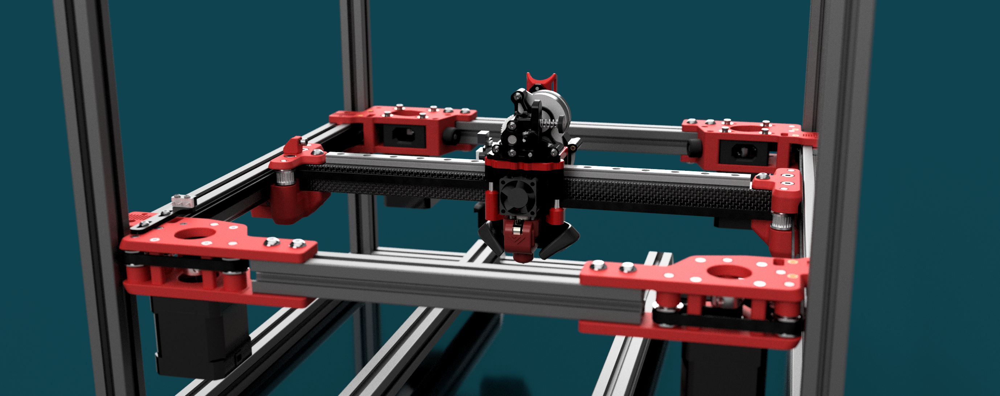
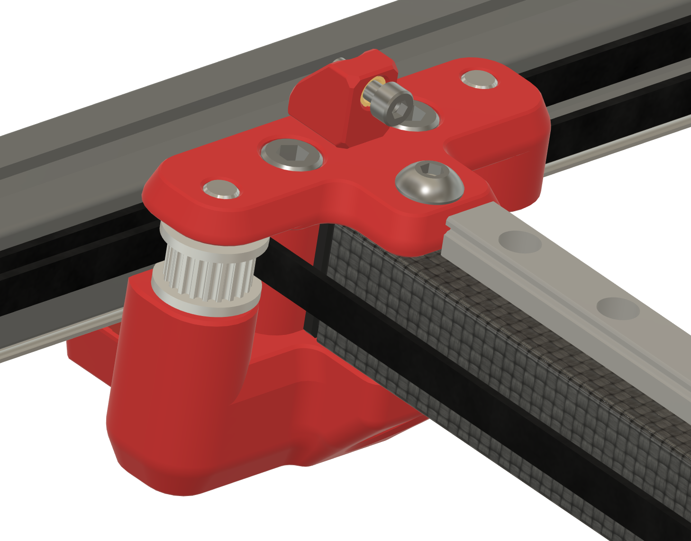
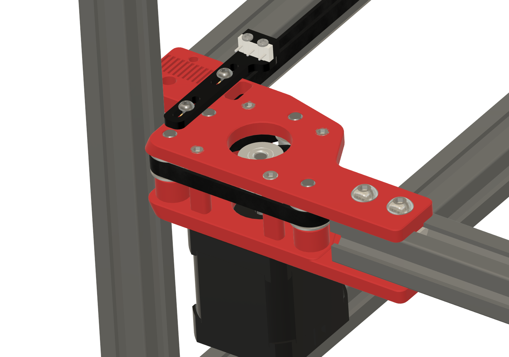
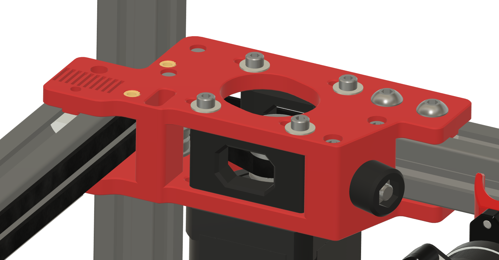

# Fourbie v1

Fourbie is a collection of mods aimed at increasing the performance of the Voron 2.4. 
In short it's an AWD system with a VZBot style toolhead. The X rail mounts on top of the X member and the toolhead is balanced over the top. Belts terminate on the front on one end and the rear on the other. This leads to a more balanced gantry than the stock voron allowing for increased performance. A front extrusion is added to support the front AB drives. There is support for CF tubes and extrusions. It also supports the use of a single MGN9 or MGN12.

The primary components of the MOD are 
* Front AB drives for AWD Support
* Rear AB drives with integrated Tensioners
* XY Joints

CAD can be found here: 

   https://drive.google.com/file/d/1AhVO8JxvDxypqgWyNXzLK3HZzntU7isS/view?usp=sharing
   https://drive.google.com/file/d/1FDfTh_o8sUtzyHR29BRvmarWRINtGYFZ/view?usp=drive_link
   
STL's are in this repository

These are all designed to be used together, however they could be used in a number of other configurations
Possible configurations include:

    * AWD with all of the mods and VZ printhead style toolheads.
    
    * AWD with using the front and rear AB drives from this mod, Redoubt XY Joints and Voron style toolheads. 
    
    * 2WD using the XY Joints and rear AB from this mod, Redoubt front idlers and VZ Printhead style toolheads.
    

The standard configuration is all of the above mods together. This is what is tested. All other potential configurations are untested. 
Note that this is an advanced mod. There is no build documentation. Bom will not be comprehensive. It is expected that you will inspect the CAD and do the work to figure out what you need to install it. 

Due to the number of idlers, you need to build to spec and take your time to make sure everything is properly built and aligned, front to back. Failure to do this will lead to your fourbie eating all of your belts. Nom. Also before printing make sure that you have properly tuned your filament and that it is producing dimensionally accurate parts. This MOD has been designed with very tight tolerances and improper calibration will lead to problems. 

## XY Joints

Two versions of the XY joints are included in the mod, one for CF tubes and one for extrusions.
From our testing a CF tube provides better performance.
Either version supports MGN12 or MGN9. The more balanced gantry allows for the use of MGN9 as having the toolhead balanced over the top of the rail rather than hanging off the front means that a lighter duty rail can be used without degrading stability. In our testing the weight savings by going to MGN9 leads to better performance.
The front idler positioning is the same as Redoubt meaning this is compatible with Redoubt front idlers with either the rear AB drives from this mod or the Redoubt motor mounts. 
The XY joints are designed to be used with pins rather than bolts(Voron default) or shoulder screws(Redoubt default)

## Front AB drives. 

There are two versions of the Front AB drives. 

    * With Extrusion
    
    * Without extrusion
    

Front AB drives without extrusion are untested and not recommended. The addition of a front extrusion stabilises the front AB drives. The addition of motors on the front of the gantry could lead to the fron AB drives twisting and could cause problems with your belts. Extrusion length is 210mm/260mm/310mm for v2.4 250/300/350.
All idler and pulley stacks use pins rather than bolts. As per design all smooth idlers are designed to use bearings, and toothed idlers use toothed idlers. There is support in the CAD for Gates genuine and non-genuine idlers. 

The return belts for the AB drives use redoubt belt spacing and therefor are compatible with redoubt XY joints. 

## Rear AB drives

Rear AB drives use integrated tensioners using an M5 bolt. Design was originally based on the Redoubt idlers, but then heavily modified to allow for visibility of the pulleys so you can confirm that your belts are running true.
Note that as with the XY joints and Front AB drives these are designed for use with pins rather than bolts or shoulder screws for the idler stacks. 
Rear AB drives allow for about 6.5mm of tensioning travel. This is enough, though you will want to put a little bit of tension on your belts when installing them
## Recommended configuration

* MGN9 for X rail.
* CF Tube for X rail
* Front AB drives with extrusion

An NF Crazy or Mosquito is recommended to minimise loss of Y. With an NF crazy there is no loss of X and about 25mm loss on Y. Given that most people generally  do not print in the outer 1cm of the bed on Voron this is very little real world loss of build volume. 
We are looking at options for BerdAir to reduce loss of build volume down to the minimum. 

## Tips
It's easiest to run the belts without the tops on the front and rear AB drives. 

## BOM

.... we might put something here. 

## Credit/Attribution
Credit goes to the Voron team for they great work creating the Voron 2.4 https://vorondesign.com/voron2.4
Annex Engineering that inspired some elements of the rear AB drives.  https://github.com/Annex-Engineering/Redoubt
Aive from the Makerbogans discord who's work on an AWD drive system for voron 2.4 defined the belt path for the front AB drives. 
The VZBot team for the VZ printhead - which made developing this mod much faster and also allows for the the use of many more toolhead configurations than we would have provided support for otherwise. https://github.com/VzBoT3D/Vz-Printhead-Printed
Thanks to Vez for giving permission to include the printhead in the CAD. 

